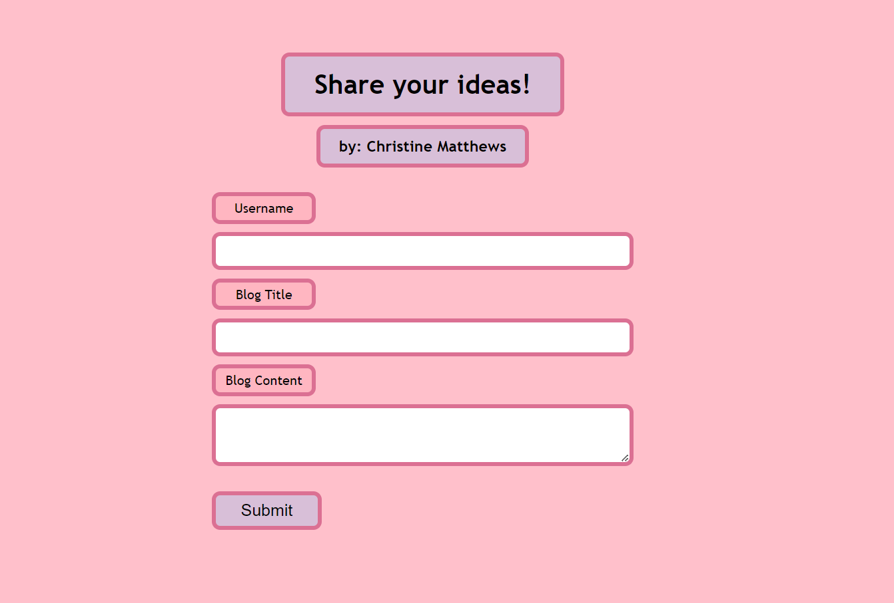
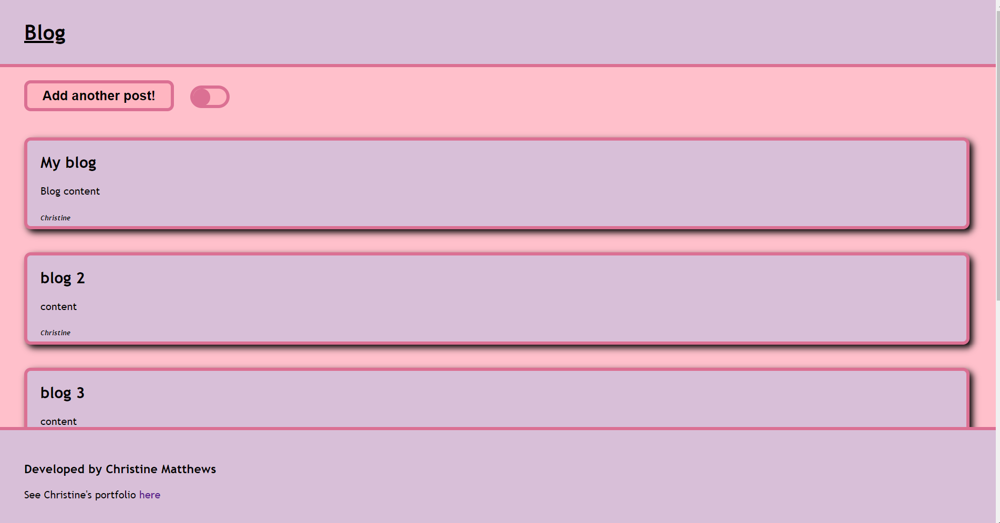
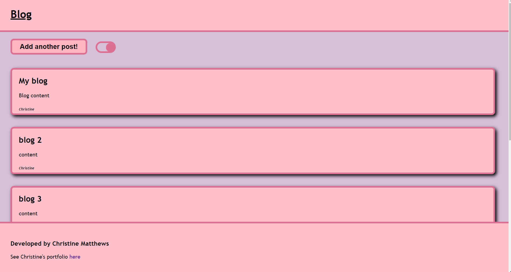
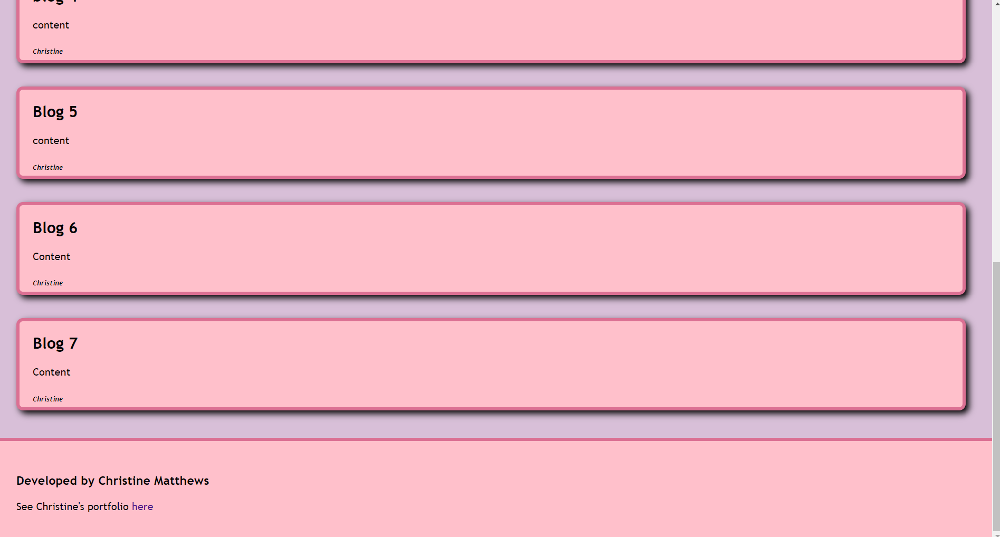

# Personal-Blog
Website designed to showcase usage of Web APIs 

## Description
This project showcases my use of web APIs in local storage. The form values are stored in local storage, which is then used to pull the data needed to create the blog posts on the next page. 

## Installation
N/A

## Usage
To use this app, fill out the form with a username, blog title, and content wanted to be added to the blog post. Once that is finished, click submit. If you click submit with nothing added to the form, an alert will appear, prompting you to fill out the form. 

Once you are redirected to the blog page, you can see your post added to the list of posts you've submitted. There is a button to back to the form to add another post and a toggle button to change the display from dark to light. At the bottom of the page, there is a footer with my name and portfolio information. 

In the DevTools application folder, you should see each of your form inputs in local storage in an array converted into a string. 

## Screenshots
Form:

Blog Page:

Blog Page Dark Mode:

Blog page scrolled to the end:

## Website
<a href="https://cmatthews3212.github.io/Personal-Blog/">Personal Blog Website</a>

## Credits
- W3 Schools to help with building the form 
    - https://www.w3schools.com/tags/tag_textarea.asp#:~:text=The%20element%20is%20often,attributes%20(or%20with%20CSS).
    - https://www.w3schools.com/html/html_forms.asp 
- Virtual assistent helped with building the form data on lines 28-35 in commit message "Put objects into an array and add forloop"

## License
Please refer to the LICENSE in the repo.

## Badges
N/A

## Features
N/A

## How to Contribute
N/A

## Tests
N/A
